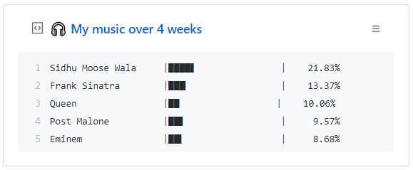

# Spotify Pin

## About repo

This repo contains necessary script for updating the GitHub Gist with your top Spotify artists over 4 weeks. Inspired by the profile of [Jack](https://github.com/jacc). Look at his profile, he's got an awesome pin collection on his profile.



Desi at Heart ❤️(Moosewala on top)

## Usage

1. Clone the repository

    ```bash
    git clone https://github.com/puneet29/SpotifyPin.git
    cd SpotifyPin
    ```

2. Create new virtual environment
    - On windows:

        ```bash
        python -m venv venv
        ```

    - On Linux:

        ```bash
        python3 -m venv venv
        ```

3. Activate virtual environment
    - On windows:

        ```bash
        venv\Scripts\activate
        ```

    - On Linux:

        ```bash
        . venv/bin/activate
        ```

4. Install all the dependencies

    ```bash
    pip3 install -r requirements
    ```

5. Update ```credentials.py```. Generate new token for Gist privileges from Settings->Developer Options.

6. Update ```driver.py```. Change the username to your own username.

7. Update ```run.bat```. Update the path to cloned directory.

8. (For windows only) Setup a new task in task scheduler. Setup a time at which the run.bat file will run in background.
